# 📱 Awesome 2-in-1 Tablet Computer Hardware 🖊️

  
  
  
  
  
  

  

> 🚀 **Curated List of Commercial 2-in-1 Tablet Hardware & Open-Source Linux Software Projects**  
> *Focused on Detachable & Convertible Laptops, Touchscreen Linux Support, IPTS Drivers, Stylus-Optimized Applications, and Digital Note-Taking.*

---

## 📑 Table of Contents
- [📌 Overview](#-overview)
- [🏬 Commercial 2-in-1 Tablet Hardware (Market Analysis & Comparison)](#-commercial-2-in-1-tablet-hardware-market-analysis--comparison)
- [⚡ Open-Source Software Projects & Linux Drivers](#-open-source-software-projects--linux-drivers)
  - [🐧 Surface Linux & Touchscreen Drivers](#-surface-linux--touchscreen-drivers)
  - [📝 Stylus Note-Taking & Annotation Apps](#-stylus-note-taking--annotation-apps)
  - [🎨 Professional Digital Painting & Vector Graphics](#-professional-digital-painting--vector-graphics)
  - [🤖 Android Subsystem & Linux Emulation](#-android-subsystem--linux-emulation)
  - [🖥️ Touch-Optimized Desktop Environments & On-Screen Keyboards](#-touch-optimized-desktop-environments--on-screen-keyboards)
  - [🛠️ Hardware Maintenance & Diagnostics](#-hardware-maintenance--diagnostics)
- [🤝 How to Contribute](#-how-to-contribute)
- [💖 Support & Community](#-support--community)
- [⚠️ Disclaimer](#-disclaimer)
- [📈 Star History](#-star-history)

---

## 📌 Overview

The **2-in-1 tablet computer hardware ecosystem** bridges the gap between ultra-portable tablet touchscreens and high-performance laptop computing. This repository tracks major commercial hardware options (such as Microsoft Surface, Apple iPad Pro, TUXEDO InfinityFlex, ASUS ROG Flow, and Lenovo ThinkPad X1 Fold) alongside **open-source Linux kernel drivers, custom kernels, and stylus-optimized applications** that allow users to break free from proprietary operating system limits.

---

## 🏬 Commercial 2-in-1 Tablet Hardware (Market Analysis & Comparison)

> 📊 **Estimated Market Size & Industry Structure:**  
> The global 2-in-1 PC and detachable tablet market size is estimated at **~$85 Billion USD (2026)** and is projected to expand at a CAGR of ~7.2%. The hardware market is **highly concentrated**, dominated by multi-billion dollar tech giants (Apple, Microsoft, Dell, Lenovo, HP, ASUS, and Samsung). However, niche Linux-native hardware vendors (like TUXEDO Computers) and specialized budget OEMs (Chuwi, Minisforum) serve the growing demand for open bootloaders, upgradeability, and native Linux touchscreen support.

The table below compares top commercial 2-in-1 tablet hardware platforms, **sorted in descending order by company annual revenue / valuation**:

| 💻 Product Platform | 📐 Form Factor & OS | 🏢 Company Valuation / Revenue | 💰 Specific Starting Pricing | 🎁 Free Tier / Trial Limits | 🐧 Key Highlights & Linux Support |
| :--- | :--- | :--- | :--- | :--- | :--- |
| **[Apple iPad Pro](https://www.apple.com/ipad-pro/)** | 13" Detachable   *(iPadOS)* | **$3.4 Trillion Market Cap**   *(~$385B Annual Revenue)* | **$999.00** (11-inch)   **$1,299.00** (13-inch M4) | **3 Months Apple Arcade & TV+** free trial with purchase; iPadOS pre-installed | Unmatched M4 hardware & Ultra Retina XDR display. **Bootloader (iBoot) locked** — Linux cannot be installed. |
| **[Microsoft Surface Pro](https://www.microsoft.com/en-us/surface/devices/surface-pro)** | 13" Detachable   *(Windows 11)* | **$3.1 Trillion Market Cap**   *(~$245B Annual Revenue)* | **$999.00** (Surface Pro 11 ARM)   **$1,199.00** (Surface Pro 9/10 Intel) | **30-Day Microsoft 365 Family** trial included with Windows license | The archetypal 2-in-1 detachable. **Excellent Linux support** via `linux-surface` kernel patches for touch, pen, and keyboard. |
| **[Samsung Galaxy Tab S9 Ultra](https://www.samsung.com/)** | 14.6" Detachable   *(Android / One UI)* | **$350 Billion Market Cap**   *(~$200B Annual Revenue)* | **$1,199.99** (256GB Wi-Fi) | **4 Months YouTube Premium & 6 Months Clip Studio Paint EX** trial | Stunning 14.6" Dynamic AMOLED 2X, S-Pen included. Android ecosystem with DeX desktop mode. Bootloader locked on Snapdragon models. |
| **[Dell Latitude 7320 / 7350 Detachable](https://www.dell.com/)** | 13" Business Detachable   *(Windows 11 Pro / Ubuntu)* | **$80 Billion Market Cap**   *(~$88B Annual Revenue)* | **$1,429.00** (Latitude 7350 Detachable) | **30-Day Dell ProSupport & McAfee Security** enterprise trial | Rugged business chassis with Intel Core Ultra processors. Native Linux x86 kernel driver support out of the box. |
| **[Lenovo ThinkPad X1 Fold](https://www.lenovo.com/)** | 16.3" Folding OLED Convertible   *(Windows 11 Pro)* | **$12 Billion Market Cap**   *(~$57B Annual Revenue)* | **$2,499.00** (Base 16" Folding model) | **30-Day Lenovo Vantage Enterprise** utilities included | Innovative folding display panel. Convertible into multi-window desktop setup or full-screen digital tablet. |
| **[HP Elite x2](https://www.hp.com/)** | 13" Business Detachable   *(Windows 11 Pro)* | **$28 Billion Market Cap**   *(~$53B Annual Revenue)* | **$1,549.00** (Base Enterprise Model) | **30-Day HP Wolf Security Enterprise** trial included | High-security business detachable with detachable backlit keyboard and active stylus pen digitizer. |
| **[ASUS ROG Flow Z13](https://rog.asus.com/)** | 13.4" Gaming Detachable   *(Windows 11)* | **$14 Billion Market Cap**   *(~$16B Annual Revenue)* | **$1,799.99** (Intel i9 + RTX 4060) | **3 Months Xbox Game Pass Ultimate** included | Gaming-grade 2-in-1 tablet with discrete GPU. Vapor chamber cooling keeps detachable keyboard sweat-free. |
| **[Minisforum V3](https://www.minisforum.com/)** | 14" AMD Detachable   *(Windows 11 Pro)* | **~$100 Million Revenue** | **$1,199.00** (AMD Ryzen 7 8840U) | **30-Day Return Guarantee** & lifetime firmware support | AMD Hawk Point APU tablet with 2.5K 165Hz display. Linux Kernel 6.9+ provides native touchscreen & pen drivers. |
| **[Chuwi UBook X / Hi10 Max](https://www.chuwi.com/)** | 12" Budget Convertible   *(Windows 11 Home)* | **~$50 Million Revenue** | **$299.00** (Hi10 Max Intel N100)   **$359.00** (UBook X) | **Windows 11 Home License** pre-installed + 1-Year Hardware Warranty | Affordable entry point for light web browsing, PDF reading, and handwriting notes. Good Linux x86 compatibility. |
| **[TUXEDO InfinityFlex 14](https://www.tuxedocomputers.com/)** | 14" 3-in-1 Convertible   *(TUXEDO OS / Linux)* | **~$15 Million Revenue** | **€1,189.00** (~$1,295 USD) | **TUXEDO OS 100% Free Forever** (Pre-installed open-source KDE Plasma 6) | **First 3-in-1 tablet designed specifically for Linux**. 360° hinge, MPP 2.0 4096-level pen, upgradeable RAM (up to 64GB). |

---

## ⚡ Open-Source Software Projects & Linux Drivers

The open-source community provides custom kernels, input daemons, desktop gestures, and stylus applications that transform 2-in-1 hardware into powerful touch-first Linux workstations.

Below, all open-source repositories are **sorted in descending order by GitHub Star Count** within their respective functional categories. Each repository badge links directly to its **stargazers page**.

### 🐧 Surface Linux & Touchscreen Drivers

| Repository | GitHub Stars | Description |
| :--- | :--- | :--- |
| **[linux-surface/linux-surface](https://github.com/linux-surface/linux-surface)** |  | **The essential Linux kernel & driver suite** for Microsoft Surface devices. Enables touchscreen, pen digitizers, detachable keyboards, power/thermal management, and Wi-Fi across Surface Pro 3–11. |
| **[linux-surface/iptsd](https://github.com/linux-surface/iptsd)** |  | User-space daemon for Intel Precise Touch & Stylus (IPTS) on Microsoft Surface tablets, processing raw touch and pen pressure data. |
| **[shalin-dev/surface-pro-6-arch-gnome](https://github.com/shalin-dev/surface-pro-6-arch-gnome)** |  | Automated setup scripts to turn Surface Pro 6 into an iPad-like touch Linux tablet running Arch Linux + GNOME + Touchégg + Maliit. |
| **[dwhinham/archiso-aarch64-sp11](https://github.com/dwhinham/archiso-aarch64-sp11)** |  | Arch Linux porting & ISO generation project tailored for ARM Snapdragon X Elite/Plus Surface Pro 11 tablets. |

### 📝 Stylus Note-Taking & Annotation Apps

| Repository | GitHub Stars | Description |
| :--- | :--- | :--- |
| **[xournalpp/xournalpp](https://github.com/xournalpp/xournalpp)** |  | **The premier open-source handwriting & PDF annotation app**. Features pressure sensitivity, Wacom/MPP/Apple Pencil support, LaTeX math rendering, audio recording, and grid templates. |
| **[flxzt/rnote](https://github.com/flxzt/rnote)** |  | Modern vector-based drawing and note-taking application written in Rust and GTK4. Supports infinite canvas, pressure sensitivity, shape recognition, and PDF export. |
| **[LinwoodCloud/Butterfly](https://github.com/LinwoodCloud/Butterfly)** |  | Cross-platform infinite canvas note-taking app with full stylus support, dark mode, and page background templates. |
| **[saber-notes/saber](https://github.com/saber-notes/saber)** |  | Hand-written note-taking app designed for tablets and convertible laptops, featuring automatic sync, pen pressure, and shape tools. |
| **[styluslabs/write](https://github.com/styluslabs/write)** |  | Distraction-free vector handwriting software with smooth line rendering, auto-reflow, and bookmarking. |

### 🎨 Professional Digital Painting & Vector Graphics

| Repository | GitHub Stars | Description |
| :--- | :--- | :--- |
| **[johnfactotum/foliate](https://github.com/johnfactotum/foliate)** |  | Feature-rich e-book reader optimized for touchscreens, offering swipe gestures, annotations, dictionary lookup, and text-to-speech. |
| **[KDE/krita](https://github.com/KDE/krita)** |  | Professional open-source digital painting, sketching, and illustration application with 100+ brushes, pen stabilization, and touch gesture support. |

### 🤖 Android Subsystem & Linux Emulation

| Repository | GitHub Stars | Description |
| :--- | :--- | :--- |
| **[waydroid/waydroid](https://github.com/waydroid/waydroid)** |  | Container-based approach to run a full Android OS inside LXC on Linux tablets with native multi-touch GPU acceleration. |

### 🖥️ Touch-Optimized Desktop Environments & On-Screen Keyboards

| Repository | GitHub Stars | Description |
| :--- | :--- | :--- |
| **[touchegg/touchegg](https://github.com/touchegg/touchegg)** |  | Multi-touch gesture recognizer for Linux desktop environments (swipe to switch workspaces, pinch to zoom, tap to click). |
| **[maliit/keyboard](https://github.com/maliit/keyboard)** |  | Core touch-first virtual on-screen keyboard for Wayland, KDE Plasma, and GNOME environments. |

### 🛠️ Hardware Maintenance & Diagnostics

| Repository | GitHub Stars | Description |
| :--- | :--- | :--- |
| **[OpenBoardView/OpenBoardView](https://github.com/OpenBoardView/OpenBoardView)** |  | Open-source boardview file viewer for hardware repair enthusiasts, used to inspect motherboard circuit traces on Surface and iPad devices. |

---

## 🤝 How to Contribute

We welcome contributions from hardware owners, Linux kernel hackers, and note-taking software developers!

1. 🍴 **Fork** this repository.
2. ✏️ **Edit** `README.md` to add new commercial 2-in-1 hardware platforms or open-source tablet projects.
3. 🏷️ Ensure all open-source entries include a valid GitHub star badge pointing to `https://github.com/owner/repo/stargazers`.
4. 🚀 Submit a **Pull Request** with a detailed explanation of your addition.

Refer to [https://github.com/ishandutta2007/Awesome-Awesome-Awesome](https://github.com/ishandutta2007/Awesome-Awesome-Awesome) for more curated lists!

---

## 💖 Support & Community

Thank you for exploring the **Awesome 2-in-1 Tablet Computer Hardware** project! If you found this list helpful, please consider supporting the project:

- ⭐ **Star** this repository to show your appreciation!
- 🍴 **Fork** and share it with fellow Linux tablet enthusiasts and digital note-takers!
- ☕ **Sponsor / Buy me a coffee** to support ongoing updates and open-source documentation:  
  

---

## ⚠️ Disclaimer

- This list is community-curated for informational and educational purposes.
- Commercial 2-in-1 tablet computers contain proprietary hardware controllers; verify bootloader status and kernel compatibility before purchasing.
- Open-source kernel drivers (such as `linux-surface`) are community projects and are not officially endorsed by Microsoft, Apple, Lenovo, or Dell.

---

## 📈 Star History

